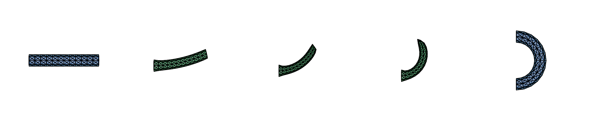
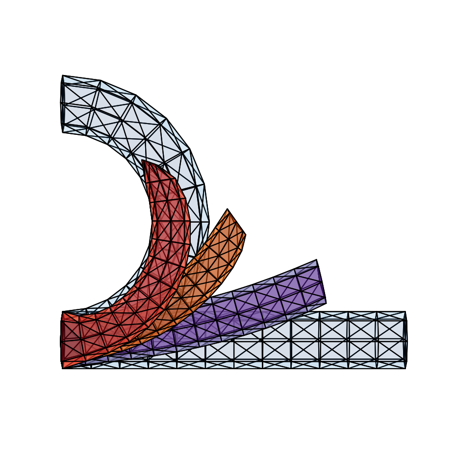
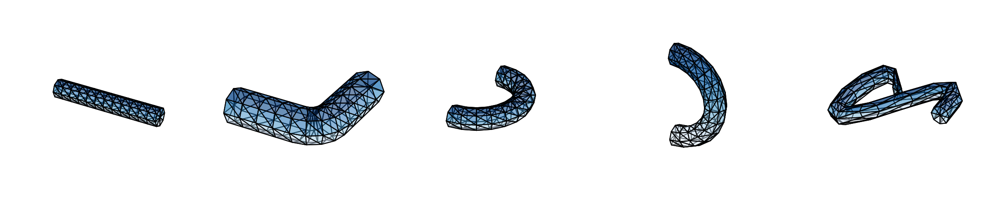

# Mesh Based Inverse Kinematics
Implementation of the method described in the paper "Mesh-Based Inverse Kinematics" by Sumner et al. 2005.
This method learns the features of a mesh through example poses and uses these features to generate new
meaningful poses that satisfy user inputted position constraints.

Techniques used: mesh processing, linear algebra, optimization



## Method

Each example mesh is described by a feature vector: the affine transformation (deformation gradient) of every
face relative to the reference mesh. The feature vector is a linear function of the vertex positions, `f = G x`,
where `G` depends only on the reference mesh. A fourth vertex is added to each face along its normal so that the
transformation is fully determined (Sumner and Popovic 2004).

The example feature vectors span a "feature space" of meaningful poses. Given position constraints on some
vertices, MeshIK finds the vertex positions `x` and blend weights `w` such that `G x` is as close as possible
to the blend of example features `M(w)`:

```
min ||G x - M(w)||    subject to the constrained vertices
x, w
```

Blending features linearly works poorly for large rotations, so each face transformation is split into a
rotation and a shear (polar decomposition). Rotations are blended in log space and shears linearly. This makes
`M(w)` nonlinear in `w`, and the problem is solved with Gauss-Newton iterations.


## Examples

Two examples of a tube, straight and curved, are enough to generate any bend in between. The front face is held
in place and the end vertex is dragged.



Interpolating in feature space between two cat poses, with no other constraints, gives intermediate poses of
the run cycle.


More tube examples are in `meshes/`: a 45 degree bend, an out-of-plane bend and a twisted coil.



Run `meshik.py` to see the tube example. `examples/make_readme_figures.py` regenerates the figures above.

## Setup

Dependencies are managed with [uv](https://docs.astral.sh/uv/). `uv sync` creates a project-local `.venv`
with numpy/scipy/matplotlib and the dev tools (pytest).

```
uv sync
uv run python meshik.py                          # run the tube example
uv run pytest                                    # run the tests
uv run python examples/make_readme_figures.py    # regenerate images/
```

`tests/golden/tube.npz` pins the tube example's output; regenerate it with `uv run python tests/make_golden.py`
only when a change in behaviour is intended.

## Code

| File | Contents |
|---|---|
| `meshik.py` | Example script: load meshes, set constraints, solve, plot |
| `model.py` | `MeshIKModel`: everything precomputed from the example meshes (`G`, feature vectors, rotation logs, shears) |
| `methods.py` | The solvers: linear feature blend, nonlinear feature blend (Gauss-Newton), solve for a target feature |
| `matrices.py` | Feature extractor `G`, feature vector <-> face transformations, polar decomposition, rotation log/exp, `M(w)` and its Jacobian |
| `constraints.py` | Build constraints and eliminate constrained vertices from the system |
| `preprocessing.py` | Load meshes, add the fourth vertex to each face |
| `utils/` | OFF/OBJ readers and matplotlib plotting |
| `meshes/` | Tube examples (`.off`) and cat run cycle poses (`meshes/cat/*.obj`) |
| `tests/` | pytest suite |

Meshes are stored as [OFF](https://en.wikipedia.org/wiki/OFF_(file_format)) files (a header line, vertex count
and face count, then one vertex or face per line). OBJ files are also read. The cat poses were exported from a
rigged Blender animation.

## Work in progress

Done
- Refactor/organize/comment code
- Include different ways of solving (interpolation without constraints)

Todo
- Implement rodrigues exponential map
- Vectorize nonlinear combination of feature vectors
- Sparse `G` and the block Cholesky solver from the paper
- Add a nice explanation of the method
