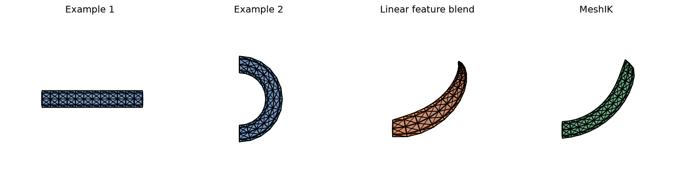
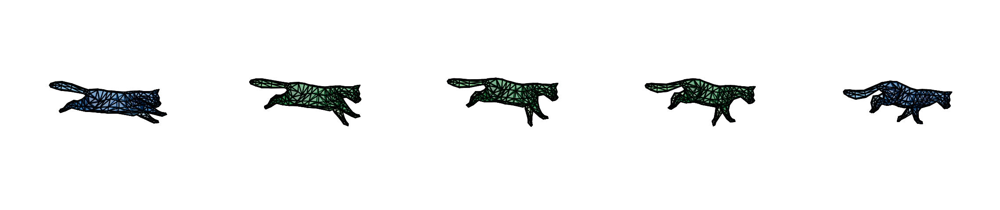

# Mesh Based Inverse Kinematics
This repo is a re-implementation of the method described in Mesh-Based Inverse Kinematics by Sumner et al. (2005). At a high level, the method learns from a set of example mesh poses and uses them to generate natural interpolations and new poses. It represents each pose with a feature vector describing the local deformation of each triangle, then interpolates these deformations by separating them into rotation and scale/shear components. It interpolates scale and shear linearly, while rotations are interpolated using an axis-angle representation.

I originally implemented this as a class project for MIT 6.8410: Shape Analysis in Spring 2023. Since then, I've done some cleanup and small improvements to make the repo a bit easier to follow and use.

## Method

The input to MeshIK is a small set of topologically identical meshes in different poses. One mesh is chosen as the **reference mesh**, and each other pose is represented by a feature vector describing how it deforms relative to that reference.

The feature vector is formed by concatenating the **deformation gradient** of every triangle. Each deformation gradient is a 3 × 3 matrix representing the local affine transformation that maps a triangle from the reference mesh to its position in the deformed mesh. A triangle's three vertices alone do not uniquely determine a 3D affine transformation, so a fourth vertex is added in the direction normal to each triangle, following Sumner and Popović (2004).

An important property of this representation is that the deformation gradients are linear in the vertex positions. If `x` contains the mesh vertex positions and `f` is its feature vector, then

```text
f = G x
```

where `G` depends only on the reference mesh.

The example poses define a **feature space** of meaningful deformations. By blending the examples in this space, we can generate a new feature vector and reconstruct a corresponding mesh pose. MeshIK adds positional constraints to turn this into an inverse-kinematics problem: given desired positions for a subset of vertices, it solves simultaneously for the mesh vertex positions `x` and the example blend weights `w`, looking for a mesh whose deformation `Gx` is as close as possible to a blended example deformation `M(w)` while exactly satisfying the vertex constraints:

```text
             min  || Gx - M(w) ||
             x,w

subject to the constrained vertex positions
```

The interesting part is how `M(w)` blends the examples. Simply blending the deformation gradients linearly produces poor results when the poses contain large rotations. For example, rotating geometry can shrink or collapse midway through an interpolation. Instead, each triangle's deformation gradient is split into a rotation and a scale/shear component using polar decomposition:

```text
T = R S
```

The scale/shear components are blended linearly. The rotations are first mapped using the matrix logarithm from `SO(3)` into `so(3)`, where they can be represented and blended in axis-angle form, then mapped back to a rotation using the matrix exponential. In other words, MeshIK interpolates the rotational and non-rotational parts of each local deformation separately, which avoids many of the artifacts caused by directly interpolating vertex positions or transformation matrices.



## Examples

Interpolating in feature space between two cat poses, with no other constraints, gives intermediate poses of
the run cycle.



Run `meshik.py` to see a tube example with position constraints. `examples/make_readme_figures.py` regenerates
the figures.

## Setup

Dependencies are managed with [uv](https://docs.astral.sh/uv/). `uv sync` creates a project-local `.venv`
with numpy/scipy/matplotlib and the dev tools (pytest).

```
uv sync
uv run python meshik.py                          # run the tube example
uv run pytest                                    # run the tests
uv run python examples/make_readme_figures.py    # regenerate images/
```

`tests/golden/tube.npz` pins the tube example's output; regenerate it with `uv run python tests/make_golden.py`
only when a change in behaviour is intended.

## Code

| File | Contents |
|---|---|
| `meshik.py` | Example script: load meshes, set constraints, solve, plot |
| `model.py` | `MeshIKModel`: everything precomputed from the example meshes (`G`, feature vectors, rotation logs, shears) |
| `methods.py` | The solvers: linear feature blend, nonlinear feature blend (Gauss-Newton), solve for a target feature |
| `matrices.py` | Feature extractor `G`, feature vector <-> face transformations, polar decomposition, rotation log/exp, `M(w)` and its Jacobian |
| `constraints.py` | Build constraints and eliminate constrained vertices from the system |
| `preprocessing.py` | Load meshes, add the fourth vertex to each face |
| `utils/` | OFF/OBJ readers and matplotlib plotting |
| `meshes/` | Tube examples (`.off`) and cat run cycle poses (`meshes/cat/*.obj`) |
| `tests/` | pytest suite |

Meshes are stored as [OFF](https://en.wikipedia.org/wiki/OFF_(file_format)) files (a header line, vertex count
and face count, then one vertex or face per line). OBJ files are also read. The cat poses were exported from a
rigged Blender animation.

## Work in progress

Todo
- Block Cholesky solver from the paper (section 4.2)
- Add a nice explanation of the method
